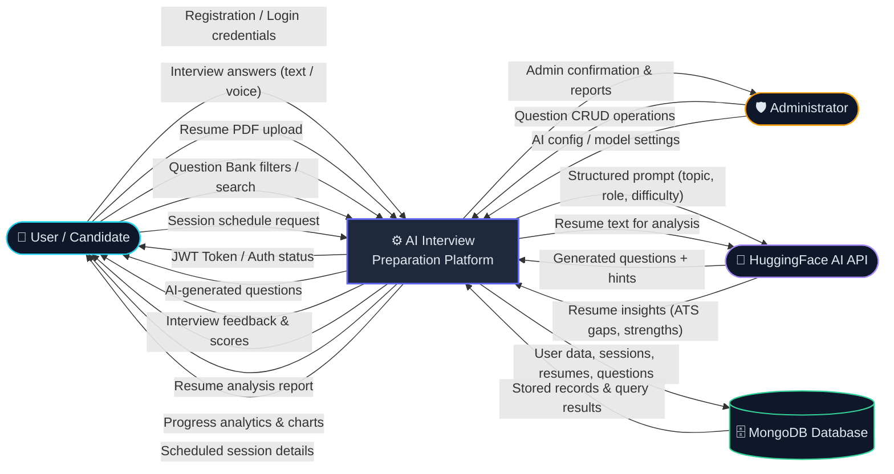
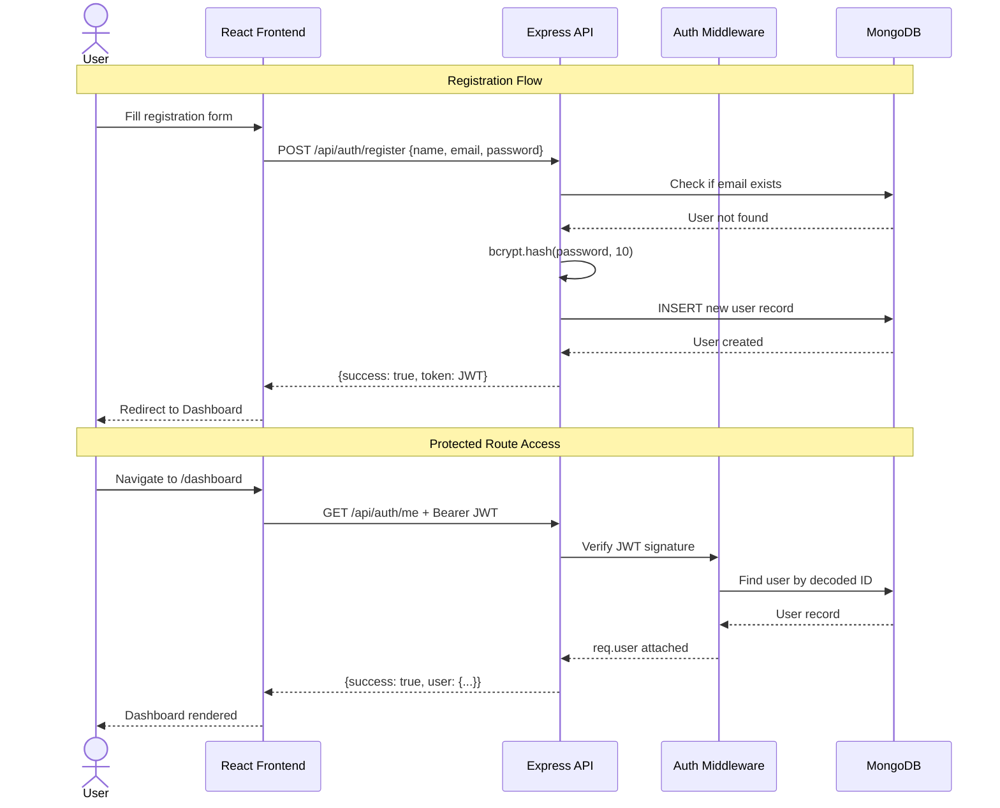

# Data Flow Diagram (DFD)
## AI Interview Preparation Platform

**Document Version:** 1.0  
**Date:** September 2026  
**Status:** Approved  

---

## Table of Contents

1. [Overview](#overview)
2. [DFD Level 0 — Context Diagram](#dfd-level-0--context-diagram)
3. [DFD Level 1 — System Processes](#dfd-level-1--system-processes)
4. [Process Descriptions](#process-descriptions)
5. [Data Stores Summary](#data-stores-summary)
6. [External Entities Summary](#external-entities-summary)
7. [Authentication & Security Data Flow](#authentication--security-data-flow)

---

## Overview

This document presents the **Data Flow Diagrams (DFD)** for the AI Interview Preparation Platform at two levels of abstraction:

- **Level 0 (Context Diagram):** Shows the entire system as a single process with all external actors.
- **Level 1:** Decomposes the system into its major functional processes with data flows between them and the data stores.

**Architecture Reference:**

```
[User Browser]  <-->  [React Frontend]  <-->  [Express API Server]  <-->  [MongoDB]
                                                      |
                                          [HuggingFace AI API]
```

---

## DFD Level 0 — Context Diagram

> The entire platform is treated as a single black-box process. External entities interact with it through defined data flows.



---

## DFD Level 1 — System Processes

> The platform is decomposed into **7 major processes**. Each interacts with specific data stores and external entities.

```mermaid
flowchart TB
    U(["👤 User"])
    A(["🛡️ Admin"])
    HF(["🤖 HuggingFace API"])

    DS_USERS[("D1: Users")]
    DS_SESSIONS[("D2: Interview Sessions")]
    DS_QUESTIONS[("D3: Question Bank")]
    DS_RESUMES[("D4: Resume Records")]
    DS_PROGRESS[("D5: Progress Records")]
    DS_SCHEDULE[("D6: Schedules")]

    P1["1.0\nUser Authentication"]
    P2["2.0\nAI Question Generation"]
    P3["3.0\nInterview Simulation"]
    P4["4.0\nResume Analysis"]
    P5["5.0\nQuestion Bank"]
    P6["6.0\nProgress and Analytics"]
    P7["7.0\nMock Interview Scheduling"]

    U -- "Credentials (email, password)" --> P1
    P1 -- "Read / Write user record" --> DS_USERS
    P1 -- "JWT Token + user profile" --> U

    U -- "Topic, role, difficulty params" --> P2
    P2 -- "Structured AI prompt" --> HF
    HF -- "Generated questions + hints" --> P2
    P2 -- "Question objects" --> U

    U -- "Start session + answer submissions" --> P3
    P3 -- "Fetch bank questions" --> DS_QUESTIONS
    P3 -- "Generate questions" --> P2
    P3 -- "Write session record" --> DS_SESSIONS
    P3 -- "Send answers for evaluation" --> HF
    HF -- "Per-question scores + feedback" --> P3
    P3 -- "Trigger progress update" --> P6
    P3 -- "Session debrief + scores" --> U

    U -- "PDF resume upload" --> P4
    P4 -- "Extracted text for AI analysis" --> HF
    HF -- "Strengths, ATS gaps, keywords" --> P4
    P4 -- "Write analysis record" --> DS_RESUMES
    P4 -- "Resume analysis report" --> U

    U -- "Filter / search queries" --> P5
    A -- "CRUD operations" --> P5
    P5 -- "Read / Write questions" --> DS_QUESTIONS
    P5 -- "Paginated question results" --> U
    P5 -- "Admin confirmation" --> A

    P3 -- "Session completed event" --> P6
    P6 -- "Write progress record" --> DS_PROGRESS
    P6 -- "Read session history" --> DS_SESSIONS
    U -- "Dashboard analytics request" --> P6
    P6 -- "Stats, charts, streak data" --> U

    U -- "Schedule session (date, topic)" --> P7
    P7 -- "Write / Read schedule record" --> DS_SCHEDULE
    P7 -- "Scheduled session confirmation" --> U
    P7 -- "Upcoming session list" --> U

    style P1 fill:#1e3a5f,stroke:#38bdf8,color:#e2e8f0
    style P2 fill:#2d1b69,stroke:#a78bfa,color:#e2e8f0
    style P3 fill:#1a3a2a,stroke:#34d399,color:#e2e8f0
    style P4 fill:#3b1a1a,stroke:#f87171,color:#e2e8f0
    style P5 fill:#3b2a00,stroke:#fbbf24,color:#e2e8f0
    style P6 fill:#1a2a3b,stroke:#60a5fa,color:#e2e8f0
    style P7 fill:#2a1a3b,stroke:#c084fc,color:#e2e8f0
    style U fill:#0f172a,stroke:#22d3ee,stroke-width:1.5px,color:#e2e8f0
    style A fill:#0f172a,stroke:#f59e0b,stroke-width:1.5px,color:#e2e8f0
    style HF fill:#0f172a,stroke:#a78bfa,stroke-width:1.5px,color:#e2e8f0
    style DS_USERS fill:#111827,stroke:#34d399,color:#e2e8f0
    style DS_SESSIONS fill:#111827,stroke:#34d399,color:#e2e8f0
    style DS_QUESTIONS fill:#111827,stroke:#34d399,color:#e2e8f0
    style DS_RESUMES fill:#111827,stroke:#34d399,color:#e2e8f0
    style DS_PROGRESS fill:#111827,stroke:#34d399,color:#e2e8f0
    style DS_SCHEDULE fill:#111827,stroke:#34d399,color:#e2e8f0
```



---

## Process Descriptions

### 1.0 User Authentication

| Attribute | Detail |
|-----------|--------|
| **Input** | Email, password (registration/login), JWT (profile access) |
| **Output** | JWT token, user profile, auth error messages |
| **Data Store** | D1: Users |
| **Logic** | Validate inputs → hash password (bcryptjs, 10 rounds) → store user or verify credentials → sign and return JWT (7-day expiry) |
| **API Routes** | `POST /api/auth/register`, `POST /api/auth/login`, `GET /api/auth/me` |

---

### 2.0 AI Question Generation

| Attribute | Detail |
|-----------|--------|
| **Input** | Topic, difficulty (easy/medium/hard), role |
| **Output** | Structured question objects (question, hints, expected answer) |
| **External** | HuggingFace Inference API (Mistral-7B-Instruct) |
| **Logic** | Build structured prompt → call HuggingFace API → parse response → return question objects (with fallback on API error) |
| **API Routes** | `POST /api/questions/generate` |

---

### 3.0 Interview Simulation

| Attribute | Detail |
|-----------|--------|
| **Input** | Session config, user answers (text / voice via Web Speech API) |
| **Output** | Session debrief with per-question scores, AI feedback, overall rating |
| **Data Stores** | D2: Interview Sessions, D3: Question Bank |
| **External** | HuggingFace API (answer evaluation) |
| **Logic** | Create session record → serve questions → accept answers with timer → evaluate via AI → on completion emit `session:completed` event → trigger ProgressObserver, ScoreObserver, FeedbackObserver |
| **API Routes** | `POST /api/interview/start`, `POST /api/interview/:id/answer`, `GET /api/interview/:id/result` |

---

### 4.0 Resume Analysis

| Attribute | Detail |
|-----------|--------|
| **Input** | PDF resume file (max 5MB, multipart/form-data) |
| **Output** | Analysis report: strengths, ATS keyword gaps, experience gaps |
| **Data Store** | D4: Resume Records |
| **External** | HuggingFace API (text analysis) |
| **Logic** | Validate file (PDF, ≤5MB) → parse PDF text with `pdf-parse` → send text to AI → parse AI response → store results linked to user → return report |
| **API Routes** | `POST /api/resume/analyze`, `GET /api/resume/history` |

---

### 5.0 Question Bank

| Attribute | Detail |
|-----------|--------|
| **Input** | Search query, filter params (category, topic, difficulty) / Admin CRUD payloads |
| **Output** | Paginated question list / CRUD confirmations |
| **Data Store** | D3: Question Bank |
| **Logic** | Apply filters/search → paginate results (default 20/page) → return. Admins can create/update/delete questions with role guard |
| **API Routes** | `GET /api/questions`, `POST /api/questions` (Admin), `PUT /api/questions/:id` (Admin), `DELETE /api/questions/:id` (Admin) |

---

### 6.0 Progress & Analytics

| Attribute | Detail |
|-----------|--------|
| **Input** | `session:completed` event from Process 3.0 / dashboard analytics request from User |
| **Output** | Total sessions, avg score, topic breakdown, weak areas, streak data |
| **Data Stores** | D5: Progress Records, D2: Interview Sessions |
| **Logic** | Observer (ProgressObserver) updates progress record after each session → dashboard endpoint aggregates session data → returns structured analytics including streak counter |
| **API Routes** | `GET /api/progress/dashboard`, `GET /api/progress/streak` |

---

### 7.0 Mock Interview Scheduling

| Attribute | Detail |
|-----------|--------|
| **Input** | Scheduled date/time, topic configuration |
| **Output** | Schedule confirmation, list of upcoming sessions |
| **Data Store** | D6: Schedules |
| **Logic** | Validate future date/time → create schedule record (user ID, time, topic) → return upcoming sessions list |
| **API Routes** | `POST /api/schedule`, `GET /api/schedule` |

---

## Data Stores Summary

| ID | Store Name | MongoDB Collection | Key Fields |
|----|------------|-------------------|------------|
| D1 | Users | `users` | `name`, `email`, `password` (hashed), `role`, `isActive`, `createdAt` |
| D2 | Interview Sessions | `interviewsessions` | `userId`, `questions[]`, `answers[]`, `scores[]`, `status`, `completedAt` |
| D3 | Question Bank | `questions` | `text`, `category`, `topic`, `difficulty`, `answer`, `hints` |
| D4 | Resume Records | `resumes` | `userId`, `filename`, `extractedText`, `analysisResult`, `createdAt` |
| D5 | Progress Records | `progress` | `userId`, `totalSessions`, `avgScore`, `topicBreakdown`, `streak`, `weakAreas` |
| D6 | Schedules | `schedules` | `userId`, `scheduledAt`, `topic`, `difficulty`, `status` |

---

## External Entities Summary

| Entity | Role | Data Sent To System | Data Received From System |
|--------|------|---------------------|---------------------------|
| **User / Candidate** | Primary actor | Credentials, answers, resume, search queries, schedule requests | JWT, questions, feedback, reports, analytics |
| **Administrator** | Manages content | CRUD operations on questions, AI config updates | Confirmation messages, admin reports |
| **HuggingFace AI API** | External AI service | Structured prompts, resume text | Generated questions, evaluation scores, resume insights |
| **MongoDB** | Data persistence layer | Write operations (users, sessions, questions, etc.) | Query results, stored records |

---

## Authentication & Security Data Flow



---

*End of DFD Document*
