# UML Use Case Diagram
## AI Interview Preparation Platform

**Document Version:** 1.0  
**Date:** September 2026

---

## System Actors

| Actor | Description |
|---|---|
| **Guest** | Unauthenticated visitor |
| **Registered User** | Authenticated platform user with full access |
| **Administrator** | Manages questions, users, and AI config |
| **HuggingFace AI** | External AI system (generates questions, evaluates answers) |

---

## Use Case Diagram

```
+==============================================================================+
|                    AI Interview Preparation Platform                          |
+==============================================================================+
|                                                                              |
|   +--------+                                         +---------+            |
|   |        |--- Register --------------------------> |         |            |
|   | Guest  |--- Login -----------------------------> | Auth    |            |
|   |        |--- View Landing Page -----------------> | System  |            |
|   +--------+                                         +---------+            |
|                                                                              |
|   +---------------+                                                          |
|   |               |--- Start Interview Session -----> [Interview Module]    |
|   |               |       |                                  |               |
|   |               |       +--<<include>>--> Generate AI Questions           |
|   |               |       +--<<include>>--> Submit Answer                   |
|   |               |       +--<<include>>--> View AI Feedback                |
|   |               |       +--<<extend>>---> Use Voice Input                 |
|   |               |                                                          |
|   |               |--- Browse Question Bank --------> [Question Bank]       |
|   |               |       +--<<extend>>---> Filter by Topic/Difficulty      |
|   |               |       +--<<extend>>---> Search Questions                |
|   |  Registered   |                                                          |
|   |    User       |--- Upload Resume ---------------> [Resume Module]       |
|   |               |       +--<<include>>--> Parse PDF                       |
|   |               |       +--<<include>>--> Get ATS Analysis                |
|   |               |       +--<<extend>>---> View Resume History             |
|   |               |                                                          |
|   |               |--- View Progress Dashboard -----> [Analytics Module]   |
|   |               |       +--<<include>>--> View Topic Performance          |
|   |               |       +--<<extend>>---> View Weak Area Highlights       |
|   |               |       +--<<extend>>---> View Study Streak               |
|   |               |                                                          |
|   |               |--- Schedule Mock Interview -----> [Scheduling Module]  |
|   |               |       +--<<extend>>---> View Upcoming Sessions          |
|   |               |                                                          |
|   |               |--- Update Profile --------------> [Auth System]         |
|   +---------------+                                                          |
|                                                                              |
|   +---------------+                                                          |
|   |               |--- Manage Question Bank --------> [Question Bank]       |
|   | Administrator |--- Manage Users ----------------> [Auth System]         |
|   |               |--- Configure AI Model ----------> [AI Module]           |
|   +---------------+                                                          |
|                                                                              |
|   +------------------+                                                       |
|   | HuggingFace AI   |<-- Generate Interview Questions ---------------      |
|   | (External System)|<-- Evaluate User Answers -----------------------     |
|   |                  |<-- Analyze Resume Content ----------------------      |
|   +------------------+                                                       |
|                                                                              |
+==============================================================================+
```

---

## Mermaid Use Case Diagram

```mermaid
flowchart TD
    Guest["👤 Guest"]
    User["👤 Registered User"]
    Admin["👤 Administrator"]
    AI["🤖 HuggingFace AI\n(External System)"]

    subgraph System["AI Interview Preparation Platform"]
        UC1["Register"]
        UC2["Login"]
        UC3["View Landing Page"]

        UC4["Start Interview Session"]
        UC5["Generate AI Questions"]
        UC6["Submit Answer"]
        UC7["View AI Feedback"]
        UC8["Use Voice Input"]

        UC9["Browse Question Bank"]
        UC10["Filter by Topic / Difficulty"]
        UC11["Search Questions"]

        UC12["Upload Resume"]
        UC13["Parse PDF"]
        UC14["Get ATS Analysis"]
        UC15["View Resume History"]

        UC16["View Progress Dashboard"]
        UC17["View Topic Performance"]
        UC18["View Weak Area Highlights"]
        UC19["View Study Streak"]

        UC20["Schedule Mock Interview"]
        UC21["View Upcoming Sessions"]

        UC22["Update Profile"]

        UC23["Manage Question Bank"]
        UC24["Manage Users"]
        UC25["Configure AI Model"]
    end

    Guest --> UC1
    Guest --> UC2
    Guest --> UC3

    User --> UC4
    UC4 -->|include| UC5
    UC4 -->|include| UC6
    UC4 -->|include| UC7
    UC4 -.->|extend| UC8

    User --> UC9
    UC9 -.->|extend| UC10
    UC9 -.->|extend| UC11

    User --> UC12
    UC12 -->|include| UC13
    UC12 -->|include| UC14
    UC12 -.->|extend| UC15

    User --> UC16
    UC16 -->|include| UC17
    UC16 -.->|extend| UC18
    UC16 -.->|extend| UC19

    User --> UC20
    UC20 -.->|extend| UC21

    User --> UC22

    Admin --> UC23
    Admin --> UC24
    Admin --> UC25

    UC5 --- AI
    UC7 --- AI
    UC14 --- AI
```



---

## Use Case Descriptions

### UC-01: Register
- **Actor:** Guest
- **Precondition:** User is not logged in
- **Main Flow:** User provides name, email, password → System validates → Password is hashed → User record created → JWT returned
- **Postcondition:** User is registered and logged in

### UC-02: Login
- **Actor:** Guest
- **Precondition:** User has a registered account
- **Main Flow:** User provides email/password → System validates credentials → JWT returned
- **Postcondition:** User receives access token

### UC-03: Start Interview Session
- **Actor:** Registered User
- **Includes:** Generate AI Questions, Submit Answer, View AI Feedback
- **Extends:** Use Voice Input
- **Precondition:** User is authenticated
- **Main Flow:** User selects topic/difficulty → Session created → AI generates questions → User answers each question (text or voice) → Session completed → Observer chain triggered (ProgressObserver, ScoreObserver, FeedbackObserver) → Debrief returned
- **Postcondition:** Session stored; progress updated

### UC-04: Upload Resume
- **Actor:** Registered User
- **Includes:** Parse PDF, Get ATS Analysis
- **Extends:** View Resume History
- **Precondition:** User is authenticated; file is PDF ≤ 5MB
- **Main Flow:** User uploads PDF → Server extracts text → AI analyzes content → Feedback returned and stored
- **Postcondition:** Resume analysis record created in DB

### UC-05: View Progress Dashboard
- **Actor:** Registered User
- **Includes:** View Topic Performance
- **Extends:** View Weak Area Highlights, View Study Streak
- **Precondition:** User has completed at least one session
- **Main Flow:** User visits dashboard → System aggregates session data → Charts and metrics displayed
- **Postcondition:** None (read-only)

### UC-06: Manage Question Bank
- **Actor:** Administrator
- **Precondition:** User has Admin role
- **Main Flow:** Admin creates, edits, or deletes questions in the question bank
- **Postcondition:** Question bank updated

---

## Observer Pattern Integration (Post-Session Event Flow)

```
InterviewSession completes
         |
         v
  emit('session:completed')
         |
    +----+----+----+-----+
    |         |         |         |
    v         v         v         v
Progress   Score    Feedback  Notification
Observer   Observer  Observer   Observer
(Updates   (Computes (Triggers  (Sends
 user DB)   score)    AI eval)   alert)
```

---

*End of UML Use Case Diagram Document*
